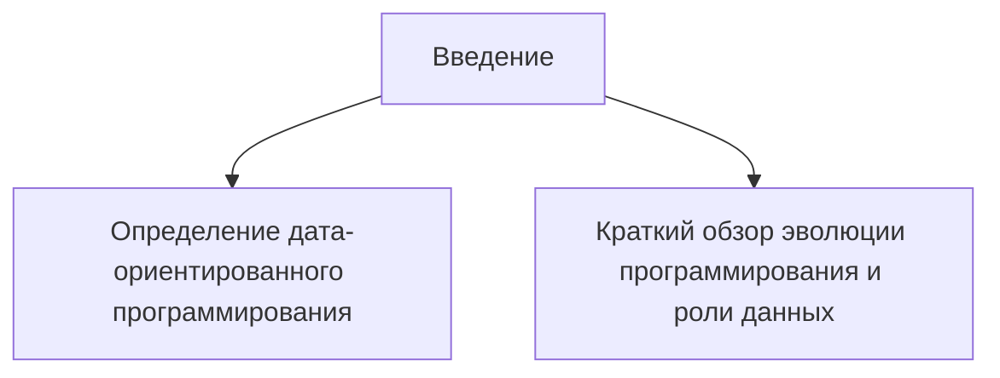
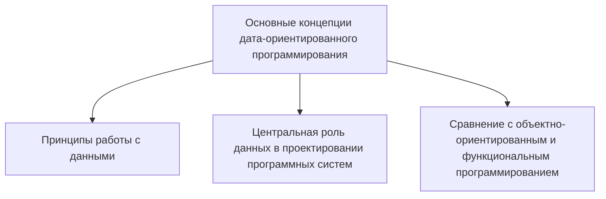
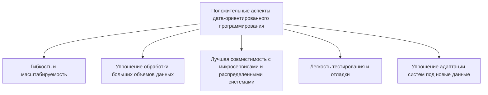
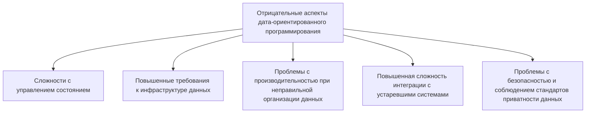
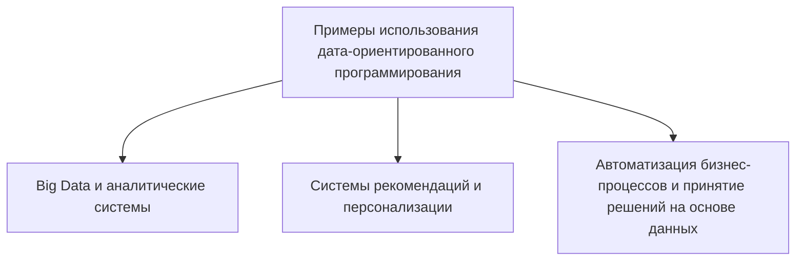
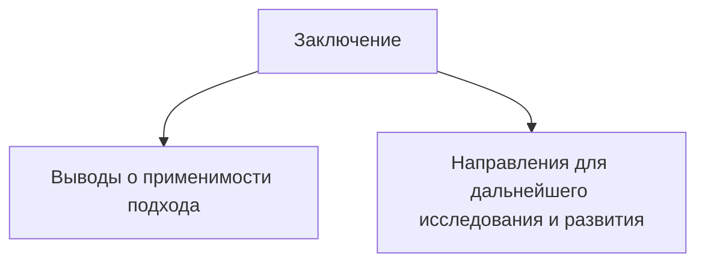

Вот пример плана для статьи по теме "Дата-ориентированное программирование: положительные и отрицательные аспекты", оформленный в виде списка через Mermaid Markdown:

### Источники по теме

<https://www.semanticscholar.org/paper/Out-of-the-Tar-Pit-Moseley-Marks/41dc590506528e9f9d7650c235b718014836a39d>

Data-Oriented Programming: Reduce software complexity
Автор: Yehonathan Sharvit (2022)

1. **"Data-Oriented Programming: Unlearning Object-Oriented Programming"** – Ben Moseley, Peter Marks. Этот ресурс раскрывает основные концепции и идеи, лежащие в основе дата-ориентированного программирования.  
   URL: [https://queue.acm.org/detail.cfm?id=2227086](https://queue.acm.org/detail.cfm?id=2227086)

2. **"Data-Oriented Programming: Clean Code for a Functional Future"** – Yehonathan Sharvit. Эта книга предлагает пошаговое руководство и анализ преимуществ и недостатков данного подхода.
   URL: [https://www.manning.com/books/data-oriented-programming](https://www.manning.com/books/data-oriented-programming)

3. **"Object-Oriented vs. Data-Oriented Design"** – обсуждение ключевых различий между объектно-ориентированным и дата-ориентированным программированием.
   URL: [https://gameprogrammingpatterns.com/data-locality.html](https://gameprogrammingpatterns.com/data-locality.html)

4. **"The Advantages of Data-Oriented Programming"** – статья, объясняющая преимущества, такие как производительность и масштабируемость.
   URL: [https://dzone.com/articles/data-oriented-programming-in-practice](https://dzone.com/articles/data-oriented-programming-in-practice)

5. **"Data-Oriented Programming Explained: Benefits and Challenges"** – краткое руководство по основам и вызовам.
   URL: [https://towardsdatascience.com/data-oriented-programming-explained-benefits-and-challenges-5fb7be058e26](https://towardsdatascience.com/data-oriented-programming-explained-benefits-and-challenges-5fb7be058e26)

Эти источники помогут глубже погрузиться в тему, разобрать основные аспекты и использовать примеры из практики.
